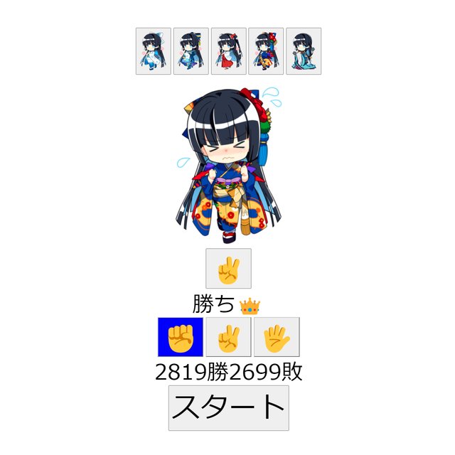

# 課題02 じゃんけん02

 

## ①課題内容（どんな作品か）
- じゃんけんゲーム リッチVer

## ②工夫した点・こだわった点
- 私の公式応援キャラクター [水晶雫](https://suishoshizuku.com/) さんと更にじゃんけんを楽しめるようにしました。
- 自動でじゃんけんをし続けてくれるモードを追加しました。
- 衣装もオリジナル、アイドル、巫女に加えて晴着と十二単を追加しました。

## ③難しかった点・次回トライしたいこと(又は機能)
- 新規ボイスの収録が難しいためボイスはありません。
- SetIntervalを使って、自動でじゃんけんし続ける機能を実装するのに苦労しました。

## ④質問・疑問・感想、シェアしたいこと等なんでも
- 水晶雫さんは、「アキバで見かけた萌えキャラコンテスト」を3連覇しています！
- [「アキバで見かけた萌えキャラコンテスト 2022」結果発表](https://akiba-pc.watch.impress.co.jp/docs/sp/1467382.html)
- [「アキバで見かけた萌えキャラコンテスト 2021」結果発表](https://akiba-pc.watch.impress.co.jp/docs/sp/1376044.html)
- [「アキバで見かけた萌えキャラコンテスト 2020」結果発表](https://akiba-pc.watch.impress.co.jp/docs/sp/1297107.html)
